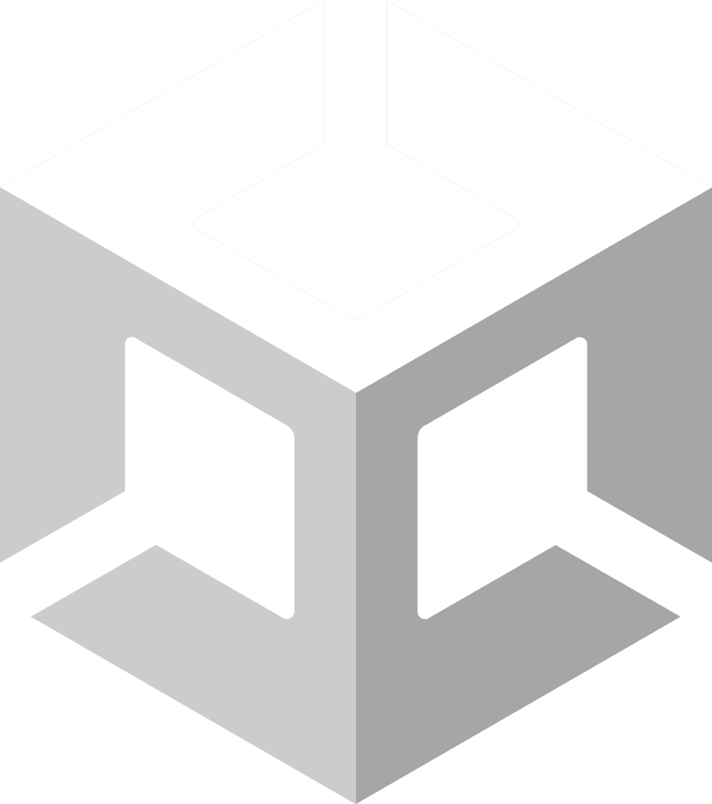
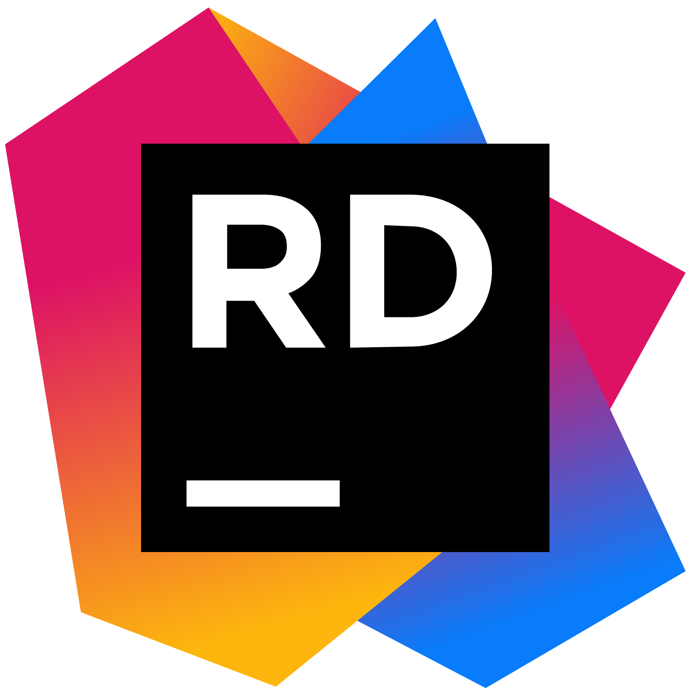
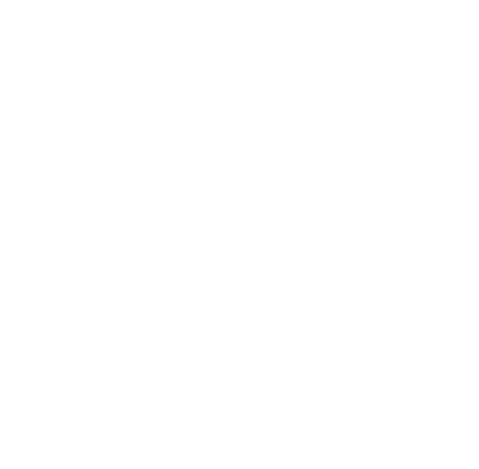

# Niels de Gruijl
I am a programmer who enjoys developing gameplay features and systems.
I love participating in Gamejams and find great accomplishment from whatching others play and enjoy games I have worked on.

## Tools

          

## Current projects
The most recent project I worked on is a game called , which is a Vampire Survivors-like game that I created for the Global GameJam 2026.
Development for this project has continued since the game jam and there are plans for future updates containing more features and content.

Another project I still have plans for is  which is a 2D physics engine developed using C++.
This project features a robust component system and "rigid body" physics objects. The most recent addition added "Sweep and Prune" optimization to the collision detection system.
